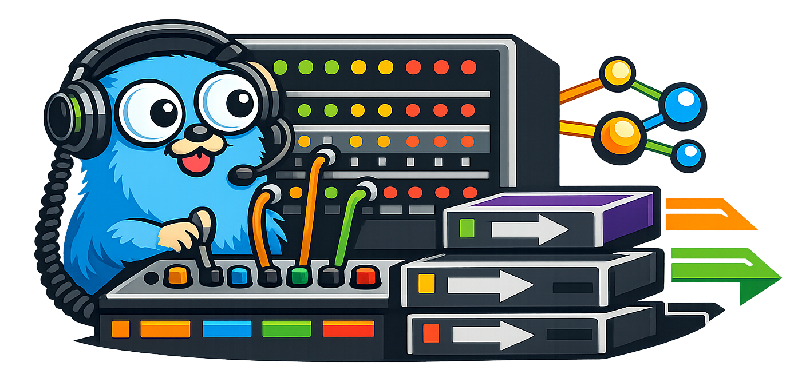
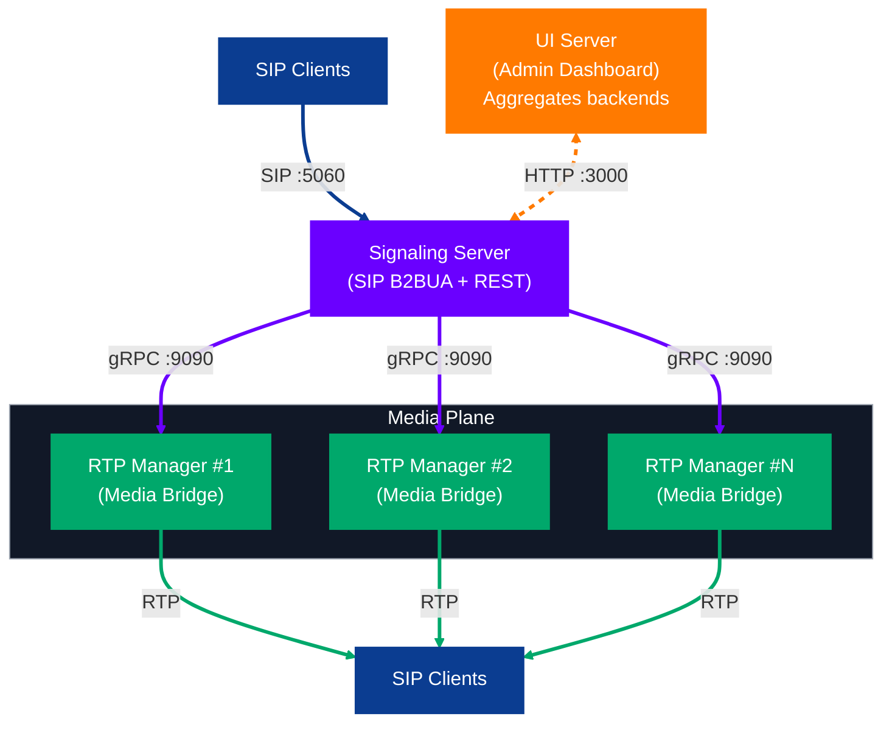

# Switchboard



> **WARNING: EXPERIMENTAL PROJECT**
> This is a **learning project** in active development. It is **pre-alpha**, **unstable**, and **not suitable for any production use**. The architecture is still being decided. Entire subsystems may be rewritten without notice. APIs will break. Config formats will change. Here be dragons.

## About

Switchboard is a VoIP platform that separates signaling and media into independently scalable components. It uses SIP for call control, RTP for media transport, and gRPC to coordinate services.



## Quick Start

```bash
# Clone
git clone https://github.com/sebas/switchboard.git
cd switchboard

# Build
make build-all

# Run all services
make run

# Or run individually
./switchboard-rtpmanager --grpc-port 9090 &
./switchboard-signaling --rtpmanager localhost:9090 &
./switchboard-ui --backends http://localhost:8080
```

## Documentation

Complete documentation is available in the [docs/](docs/) folder:

| Document | Description |
|----------|-------------|
| [Getting Started](docs/GETTING_STARTED.md) | Installation and quick start guide |
| [Architecture](docs/ARCHITECTURE.md) | System design and philosophy |
| [Configuration](docs/CONFIGURATION.md) | Environment variables and flags |
| [API Reference](docs/API_REFERENCE.md) | REST and gRPC documentation |
| [Call Flows](docs/CALL_FLOWS.md) | Detailed call sequence diagrams |
| [Dialplan](docs/DIALPLAN.md) | Route matching and actions |
| [B2BUA Design](docs/B2BUA.md) | Back-to-Back User Agent details |
| [Code Map](docs/CODE_MAP.md) | Codebase navigation guide |
| [Development](docs/DEVELOPMENT.md) | Build, test, and contribute |
| [Roadmap](docs/ROADMAP.md) | Planned features |

## Technology Stack

- **Go 1.24** - Single binaries, goroutines, and a great standard library
- **[sipgo](https://github.com/emiago/sipgo)** - Pure Go SIP stack
- **[diago](https://github.com/emiago/diago)** - B2BUA patterns and inspiration
- **[Pion](https://github.com/pion)** - RTP, SDP, and WebRTC ecosystem
- **gRPC** - Service communication between signaling and media
- **HTMX + Tailwind** - Dashboard UI

## Acknowledgments

### [Pion](https://github.com/pion)
The Pion project provides the entire foundation for RTP, SDP, and WebRTC in Go. Without Pion's clean, well-tested libraries for packet handling, SDP parsing, and media transport, building something like this would take years instead of weeks.

### [sipgo](https://github.com/emiago/sipgo) & [diago](https://github.com/emiago/diago)
Emiago's sipgo library is a pure-Go SIP stack that actually makes sense. The diago project, built on top of sipgo, provided invaluable patterns for B2BUA implementation, dialog management, and call handling.

**Thank you to all these projects. Switchboard is an experiment built on your foundations.**

## Contributing

Contributions are welcome, but please understand what you are getting into:

1. **This is unstable** - Things will break. APIs will change. Your PR might become irrelevant overnight.
2. **No promises** - This is a side project for learning. Response times will vary.
3. **Discussion first** - For anything non-trivial, open an issue to discuss before submitting a PR.

If you are also curious about VoIP systems and want to experiment together, pull up a chair. If this project somehow helps you learn something, that is the whole point.
