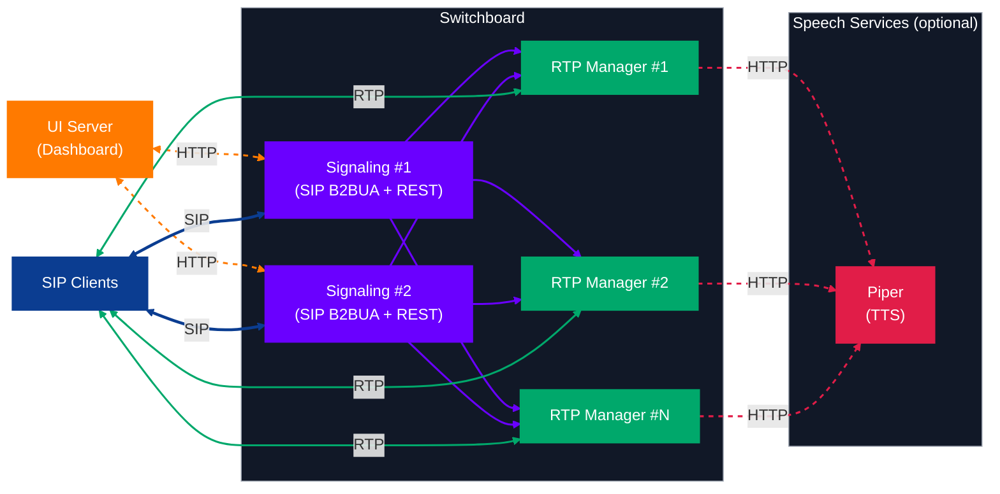
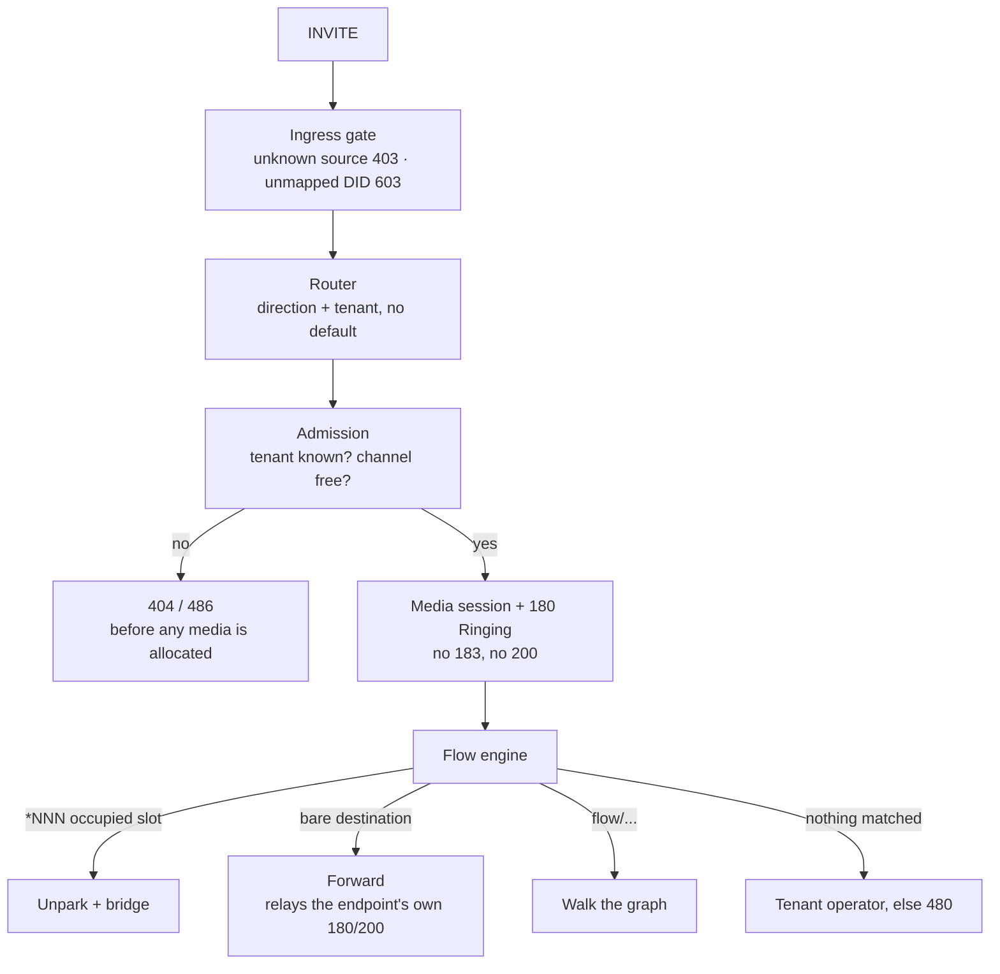
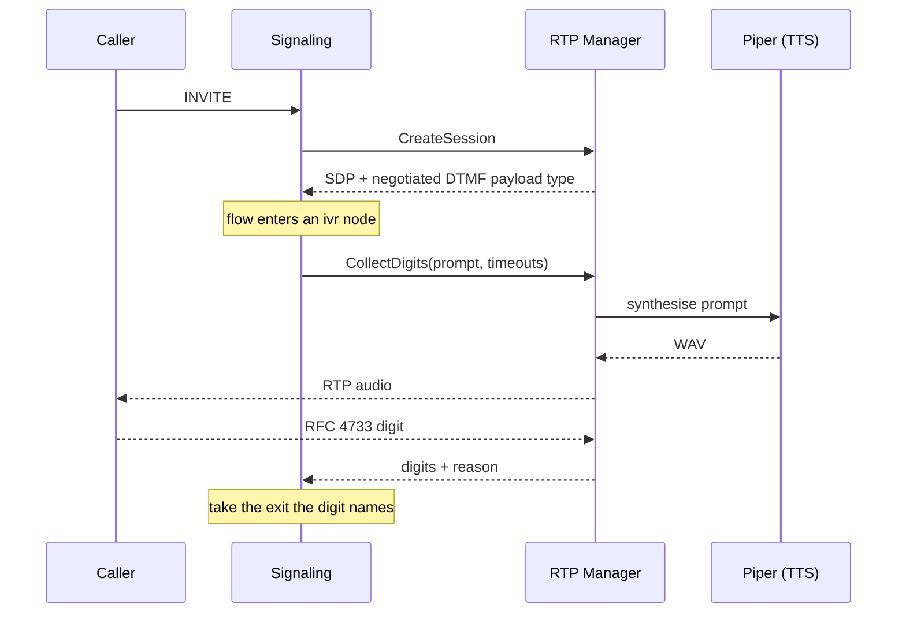

# Switchboard


> **WARNING: EXPERIMENTAL PROJECT**
> This is a **learning project** in active development. It is **pre-alpha**, **unstable**, and **not suitable for any production use**. The architecture is still being decided. Entire subsystems may be rewritten without notice. APIs will break. Config formats will change. Here be dragons.

## About

Switchboard is a **full-stack VoIP server and deterministic call routing engine**. It handles the call lifecycle — SIP registrations, inbound and outbound calls, call bridging, parking, and blind transfers — and routes every call through a validated **flow graph**: IVR menus, prompts, transfers, and conditional dialing, expressed as data. It separates signaling and media into independently scalable components, using SIP for call control, RTP for media transport, and gRPC to coordinate services.

Routing needs no model, no GPU, and no network egress. Every flow is checked at startup and is **provably terminating**, so a misconfigured menu is a startup error rather than a caller stuck in a loop at 2am.

Switchboard is **Kubernetes-native by design**. Live media re-anchoring allows active calls to be migrated between RTP Manager pods mid-call, making graceful drain, rolling updates, and autoscaling possible without dropping calls.

The flow **stays with the caller for the whole call**. A dial that fails does not
end it: the cursor takes that node's `no_answer`, `busy`, `rejected` or
`unavailable` exit and keeps going, so "nobody picked up" leads wherever the
graph says — another group, the operator, a closing message — rather than to a
dead end. Every one of those branches is written down in the flow file and
checked at startup, which is what makes the behaviour predictable rather than
improvised.


```mermaid
flowchart LR
  UI["UI Server<br/>(Dashboard)"]
  Clients["SIP Clients"]

  subgraph Core["Switchboard"]
    direction TB
    Sig1["Signaling #1<br/>(SIP B2BUA + REST)"]
    Sig2["Signaling #2<br/>(SIP B2BUA + REST)"]
    RTP1["RTP Manager #1"]
    RTP2["RTP Manager #2"]
    RTP3["RTP Manager #N"]
    Sig1 --> RTP1
    Sig1 --> RTP2
    Sig1 --> RTP3
    Sig2 --> RTP1
    Sig2 --> RTP2
    Sig2 --> RTP3
  end

  subgraph AI["Speech Services (optional)"]
    direction TB
    TTS["Piper<br/>(TTS)"]
  end

  %% Edges
  UI <-->|"HTTP"| Sig1
  UI <-->|"HTTP"| Sig2
  Clients <-->|"SIP"| Sig1
  Clients <-->|"SIP"| Sig2
  Clients <-->|"RTP"| RTP1
  Clients <-->|"RTP"| RTP2
  Clients <-->|"RTP"| RTP3
  RTP1 -->|"HTTP"| TTS
  RTP2 -->|"HTTP"| TTS
  RTP3 -->|"HTTP"| TTS

  %% Styling
  classDef clients fill:#0b3d91,stroke:#0b3d91,color:#ffffff,stroke-width:2px;
  classDef signaling fill:#6a00ff,stroke:#6a00ff,color:#ffffff,stroke-width:2px;
  classDef media fill:#00a86b,stroke:#00a86b,color:#ffffff,stroke-width:2px;
  classDef ui fill:#ff7a00,stroke:#ff7a00,color:#ffffff,stroke-width:2px;
  classDef ai fill:#e11d48,stroke:#e11d48,color:#ffffff,stroke-width:2px;
  classDef plane fill:#111827,stroke:#9ca3af,color:#ffffff,stroke-width:1px;

  class Clients clients;
  class Sig1,Sig2 signaling;
  class RTP1,RTP2,RTP3 media;
  class UI ui;
  class TTS ai;
  class Core,AI plane;

  %% Internal: Sig1 → RTP1,2,3
  linkStyle 0 stroke:#6a00ff,stroke-width:2px;
  linkStyle 1 stroke:#6a00ff,stroke-width:2px;
  linkStyle 2 stroke:#6a00ff,stroke-width:2px;
  %% Internal: Sig2 → RTP1,2,3
  linkStyle 3 stroke:#6a00ff,stroke-width:2px;
  linkStyle 4 stroke:#6a00ff,stroke-width:2px;
  linkStyle 5 stroke:#6a00ff,stroke-width:2px;
  %% UI ↔ Sig1, Sig2
  linkStyle 6 stroke:#ff7a00,stroke-width:2px,stroke-dasharray: 5 5;
  linkStyle 7 stroke:#ff7a00,stroke-width:2px,stroke-dasharray: 5 5;
  %% Clients ↔ Sig1, Sig2 (SIP)
  linkStyle 8 stroke:#0b3d91,stroke-width:3px;
  linkStyle 9 stroke:#0b3d91,stroke-width:3px;
  %% Clients ↔ RTP1, RTP2, RTP3
  linkStyle 10 stroke:#00a86b,stroke-width:2px;
  linkStyle 11 stroke:#00a86b,stroke-width:2px;
  linkStyle 12 stroke:#00a86b,stroke-width:2px;
  %% RTP1,2,3 → TTS  (last link is 15; there are 16 edges, 0-15)
  linkStyle 13 stroke:#e11d48,stroke-width:2px,stroke-dasharray: 5 5;
  linkStyle 14 stroke:#e11d48,stroke-width:2px,stroke-dasharray: 5 5;
  linkStyle 15 stroke:#e11d48,stroke-width:2px,stroke-dasharray: 5 5;
```

## Quick Start

```bash
# Clone
git clone https://github.com/sebacius/switchboard.git
cd switchboard

# Build
make build-all

# Run all services
make run

# Or run individually (make build-all writes into build/)
./build/switchboard-rtpmanager --grpc-port 9090 &
./build/switchboard-signaling --rtpmanager localhost:9090 &
./build/switchboard-ui --backends http://localhost:8080
```

## How It Works

Switchboard never answers a call in order to route it, and never consults a
model to decide where it goes.

### The call path


```mermaid
flowchart TD
    INVITE["INVITE"] --> Gate["Ingress gate<br/>unknown source 403 · unmapped DID 603"]
    Gate --> Route["Router<br/>direction + tenant, no default"]
    Route --> Admit["Admission<br/>tenant known? channel free?"]
    Admit -->|"no"| Reject["404 / 486<br/>before any media is allocated"]
    Admit -->|"yes"| Media["Media session + 180 Ringing<br/>no 183, no 200"]
    Media --> Engine["Flow engine"]
    Engine -->|"*NNN occupied slot"| Unpark["Unpark + bridge"]
    Engine -->|"bare destination"| Forward["Forward<br/>relays the endpoint's own 180/200"]
    Engine -->|"flow/..."| Graph["Walk the graph"]
    Engine -->|"nothing matched"| Operator["Tenant operator, else 480"]
```

Everything is deterministic. There is no fallback that behaves differently, no
service that can be down, and nothing that costs money per call.

1. **Ingress gate** — the source must be a registered user or a configured trunk
   peer. An unmapped DID is declined; there is no default tenant.
2. **Router** — classifies the call as `internal`, `inbound` or `outbound` and
   attributes it to a tenant.
3. **Admission** — the tenant must be known, and under its channel limit. The
   slot is taken **before** the media session, because what it bounds is
   physical: an RTP port, a media session, and a goroutine held for the life of
   the call.
4. **Flow engine** — call retrieval first, then the entry mapping. A bare
   destination is a one-node dial; a `flow/` entry walks the graph.

### Flows

A flow is a directed graph of nodes. Every node has the same shape — a type, a
type-specific `entry`, and `exits` mapping outcome names to other nodes.

| type | what it does | exits |
|---|---|---|
| `ivr` | plays a prompt and collects a digit | one per digit, `timeout`, `invalid`, `retries_exceeded` |
| `tts` | speaks text | `done` |
| `play_audio` | plays a file | `done` |
| `dial_user` | dials an extension or ring group | `answered`*, `no_answer`, `busy`, `rejected`, `unavailable` |
| `dial_external` | dials a symbolic external destination | `answered`*, `no_answer`, `busy`, `denied`, `failed` |
| `transfer` | blind transfer | `accepted`*, `failed` |
| `hangup` | ends the call | terminal |

`*` terminal — the flow ends, the legs bridge, and the cursor is released.
Terminal exits cannot be declared in configuration: the graph has nothing to say
about what happens after a call is connected.

**Exit names are fixed in code, not configuration.** That is what makes a typo
like `no-answer` a startup error instead of a silently dead branch found during
an outage. Every non-terminal exit must be wired, so what a caller hears when
the line is busy is always written down.

### Every flow provably terminates

Two rules, both enforced at load:

- The inter-node graph is **acyclic**.
- Repetition lives **inside** a node, bounded by a counter (`ivr.max_retries`),
  which contributes no edge to the graph.

Together they make every flow terminating by construction. A priority-ordered
dialplan cannot offer this: a `Goto` loop is discovered in production, while an
inter-node cycle is rejected at startup with the path named.

```
$ make validate
error: acme: flows.main
  flow contains a cycle: greeting -> menu -> greeting. Flows must be acyclic so
  every call is guaranteed to terminate; repetition belongs inside a node,
  bounded by a counter such as ivr.max_retries
```

### Answering, and what the caller hears

Switchboard does not answer a call to route it. A dial reached **before** any
media node forwards the INVITE, so the caller hears the destination's own
ringback and can still receive its real final response. Once a node plays media
the call is answered, and later dials bridge into media the system already owns.

A dial that fails inside a flow relays **nothing**. What the caller hears is the
graph's decision, made by whatever node the failure exit leads to — because once
a 486 reaches the caller, their call is over and no later node can run.

### Entry patterns

Extension ranges, DID blocks and number plans cannot be enumerated, so entry
mappings support patterns using a digit-map vocabulary — `X`=0-9, `N`=2-9,
`Z`=1-9, `[2-8]` sets, a trailing `.`, and literals. Deliberately not regex.

When two patterns match, the more specific wins, and specificity is **computed**
from how narrow each position is rather than declared:

```
literal 1  ·  [147] 3  ·  [2-8] 7  ·  N 8  ·  Z 9  ·  X 10  ·  "." unbounded
```

`N` beats `Z` because 8 < 9. Nothing declares a priority integer — hand-
maintained priorities were the actual defect in the dialplan this replaces.
Comparison is a per-position vector, so `NX` and `XN`, which both match `22`
with neither narrower, are rejected at load rather than silently tie-broken.

### Authorization: the config asks, the policy decides

Configuration is **not** authority. Every destination a flow produces — each
`dial_user`, `dial_external` and `transfer` target, and each ring group member
individually — is adjudicated by the tenant's Class of Service before anything
is dialed. Someone who can edit a flow file still cannot grant themselves a
trunk.

`dial_external` accepts **symbolic names only**, and no matched digit string can
become a dial target. Pattern matching selects *what to run*; it never supplies
*where to dial*.

| Control | Effect |
|---|---|
| Default-deny external | A tenant reaches no external destination unless enabled |
| Allowlist | With external enabled, only listed prefixes pass |
| Barred classes | Premium-rate, satellite and high-risk ranges blocked unconditionally |
| Symbolic narrowing | Only names the tenant defined are externally dialable |
| Spend breaker | Per-tenant daily cap on external calls |

Class of Service is checked at **load** as well as at call time, so a flow that
could never place its call is caught before a caller finds out. That check is
side-effect free, so validating a configuration cannot spend the tenant's budget.

### DTMF

Digits arrive by RFC 4733 in the media path, or by SIP INFO for endpoints
without it. The telephone-event payload type is **echoed from the offer**, never
assumed — it is a dynamic type, and real endpoints use anything in 96-127.

A prompt and its collection are one operation. Split into "play" then "collect",
a digit pressed in between lands in neither and is lost; keeping them together
also lets the first digit cut the prompt short. Digits buffer for the whole
session, so a caller who dials through a menu keeps everything they pressed.

A leg that negotiated no telephone-event says so immediately rather than waiting
for digits that cannot arrive, and the flow degrades by a declared exit.

### Call records

`--cdr-path` writes one JSON object per call: the traversal, with the exit each
node produced and the time spent there, plus the authorization verdicts.

```json
{"call_id":"...","tenant":"acme","flow":"main-ivr",
 "path":"greeting -> ring-claims -> to-operator",
 "hops":[{"node":"greeting","type":"ivr","exit":"2","duration_ms":4200,"detail":"digits 2"},
         {"node":"ring-claims","type":"dial_user","exit":"busy","detail":"busy (486 Busy Here)"}],
 "outcome":"answered"}
```

Without the path, "why did this caller end up with the operator" has no answer.

### Speech services

Routing needs nothing external. One optional service adds voice:

- **TTS** (Piper, or any OpenAI-compatible `/v1/audio/speech`) — synthesizes
  `tts` node text and `ivr` prompts. Without it, flows can still play recorded
  audio files, dial, transfer and hang up.

An **ASR** client also ships and is currently unused: nothing transcribes
anything now that the supervisor is gone. It is kept because it is exactly the
batch API a future voicemail feature needs, and it costs nothing dormant.


```mermaid
sequenceDiagram
    participant Caller
    participant Signaling
    participant RTP as RTP Manager
    participant TTS as Piper (TTS)

    Caller->>Signaling: INVITE
    Signaling->>RTP: CreateSession
    RTP-->>Signaling: SDP + negotiated DTMF payload type
    Note over Signaling: flow enters an ivr node
    Signaling->>RTP: CollectDigits(prompt, timeouts)
    RTP->>TTS: synthesise prompt
    TTS-->>RTP: WAV
    RTP-->>Caller: RTP audio
    Caller-->>RTP: RFC 4733 digit
    RTP-->>Signaling: digits + reason
    Note over Signaling: take the exit the digit names
```

### Tenant Configuration

A tenant is described by two files in `resources/tenants/`, plus a block in
`policy.json`:

1. **`<tenant>.routing.json`** — the entry mapping (patterns and literals),
   extensions, DIDs, ring groups, the operator, and the symbolic targets that
   are the only externally dialable names.
2. **`<tenant>.flows.json`** — the graphs. Optional; a tenant may route entirely
   by direct mapping.
3. **`policy.json` → `tenants.<name>`** — authorization only: what is permitted,
   never what a name means.

The two tenant files are loaded and validated **as one unit**, so a flow can
never reference a ring group the other file just removed. Both are editable
through the config API, and a write that would not load is refused with the
problems attached — nothing reaches disk unless it passes.

There is **no default tenant**. A call whose domain matches none is rejected
(404), an unmapped DID is declined (603), and an unknown source is refused
(403).

See [`docs/TENANT-EXAMPLE.md`](docs/TENANT-EXAMPLE.md) for a worked example.
`resources/tenants/` ships only `devtenant`, a minimal fixture for local testing.

### Trying a flow without SIP

`flow-smoke` walks a graph against a fake call and prints the traversal, which
is far faster than placing a call to find out what a menu does:

```bash
make flow-smoke DIALED=700 DIGITS=2
```

```
dialing "700" as internal for tenant devtenant

flow "main-ivr", 2 hop(s), 0ms
  1. greeting         (ivr)          --2--> digits 2
  2. ring-engineering (dial_user)    --answered--> bridged to user/101

path: greeting -> ring-engineering
outcome: answered

dialed:
  user/101
```

`--tenant`, `--direction`, `--routing-path` and `--policy-config` are also
accepted; they default to `devtenant`, `internal`, and the paths under
`resources/`.

### Running with TTS

```bash
# Piper TTS — https://github.com/matatonic/openedai-speech
docker run -d --name piper-tts -p 8000:8000 ghcr.io/matatonic/openedai-speech

# Point the RTP manager at it
./build/switchboard-rtpmanager --tts-server http://localhost:8000

# Register a softphone and dial 700 to reach the example menu
```

### Configuration Files

| File | Purpose |
| --- | --- |
| `resources/tenants/<name>.routing.json` | Entry mapping (patterns + literals), extensions, DIDs (**what happens** to a call to a number this tenant owns), ring groups, operator, and the symbolic names that are externally dialable |
| `resources/tenants/<name>.flows.json` | Flow graphs: menus, prompts, transfers. Optional |
| `resources/config/policy.json` | Class of Service and capacity only: channel limits, external allowlist, barred prefixes, spend breaker. A leftover `symbolic_targets` key is a hard startup error — it belongs in the routing file |
| `resources/config/trunk_peers.json` | SIP trunk peers — the ingress gate matches inbound INVITEs against these |
| `resources/config/routes.json` | **Whose** number is this — DID → tenant, global and not tenant-editable. What then happens to the call is the tenant's `dids` block |

## Vision & Roadmap

Switchboard replaces static, priority-ordered dialplans with a flow graph that
is validated at startup and provably terminates — and keeps conversation out of
the PBX, where it does not belong.

### What Works Today

- SIP REGISTER with in-memory location service
- SIP trunk peers with DID → tenant routing, and an ingress gate that rejects unknown sources
- B2BUA call bridging (A-leg to B-leg)
- RTP media bridging between sessions
- Basic admin dashboard with live updates
- Multiple RTP Manager load balancing with session affinity
- **Live media re-anchoring** — sessions can be migrated between RTP Managers mid-call, enabling graceful drain and zero-downtime updates
- RTP Manager drain API (graceful and aggressive modes) with per-session migration
- **Deterministic flow graphs on every call** — no model, no GPU, no network egress
  - Closed node vocabulary with exit names fixed in code, so an unwired or misspelled exit fails at startup
  - Acyclic inter-node graphs with counter-bounded retries: every flow provably terminates
  - Digit-map entry patterns with computed specificity; ambiguity is a load error
  - Deferred answer: a dial before any media node forwards and relays real ringback
  - Typed dial outcomes, so busy routes differently from no-answer
  - Class of Service enforced at load *and* at call time; symbolic-only external targets
  - Per-tenant admission with channel limits, taken before any media is allocated
- **DTMF** — RFC 4733 with the payload type echoed from the offer, SIP INFO fallback, type-ahead buffering
- Text-to-speech playback through a TTS server
- `validate` subcommand and `flow-smoke` harness
- Append-only call records carrying the traversal and authorization verdicts

### What Doesn't Work Yet

- Authentication (anyone can register as anyone)
- Persistent storage (everything is in-memory)
- SRTP/TLS (plaintext only)
- Presence — no SUBSCRIBE/NOTIFY handler; the only registered methods are
  REGISTER, INVITE, ACK, CANCEL, BYE and INFO
- Most SIP edge cases (re-INVITE, UPDATE, REFER, OPTIONS keepalives, etc.)
- Proper error handling in many places
- **Voicemail and call recording** — nothing writes audio to disk
- In-band DTMF tone detection (RFC 4733 and SIP INFO only)
- DTMF on a bridged leg — the bridge relays bytes without parsing them
- Attended transfer (blind only)
- Queues, callbacks, and park-as-a-node

### What Might Be Wrong

- The entire B2BUA implementation
- SDP manipulation
- RTP timing and jitter handling
- Basically anything that has not been tested with real traffic

### Where We're Headed

**E911 — the next change, and a prerequisite for production traffic.** Nothing
currently special-cases `911`. A tenant with the default `allow_external_dial:
false` cannot dial it at all, and a perfectly reasonable `"9."` outbound pattern
silently swallows it. Kari's Law requires direct 911 dialing without a prefix
plus on-site notification, and RAY BAUM'S Act requires a dispatchable location.
Emergency routing must bypass Class of Service entirely and be un-configurable —
it cannot be something a tenant can misconfigure. The validator currently warns
about pattern shadowing; that is a guardrail, not a solution.

**Voicemail.** The `voicemail` node was deliberately cut from the flow
vocabulary because recording forces a media-plane refactor: there is no
persistent per-session RTP socket, so a recorder cannot coexist with playback.
The ASR client is already the batch API transcription needs.

**Barge-in beyond menus.** The first digit already cuts an `ivr` prompt short,
because collection owns the socket while the prompt plays. Interrupting a `tts`
node needs the same socket ownership generalised.

**Conversational AI as an external agent.** The LLM supervisor was removed from
the call path, not from the product. Conversation belongs behind a destination —
reached like any other endpoint, with its own realtime-voice stack — rather than
inside a PBX that must answer an INVITE in milliseconds. A flow can dial it; the
PBX need not know what it is.

**Recording and real-time transcription**, once the media plane supports it.

**WebRTC gateway.** Browser-based agents, supervisors, and click-to-call.

**Smart autoscaling and zero-downtime updates.** Live media re-anchoring already
works; the missing piece is orchestration that drains pods and scales on load.

**MCP control plane.** Programmatic access to configuration and live call state,
so flows and tenants can be managed by tooling rather than by editing files.

## Documentation

| Document | Description |
|----------|-------------|
| [Configuration](docs/CONFIGURATION.md) | Every flag and environment variable, per service |
| [Tenant example](docs/TENANT-EXAMPLE.md) | A worked tenant: routing table, flows, policy, and the two DID lookups |

## Technology Stack

- **Go 1.24** - Single binaries, goroutines, and a great standard library
- **[sipgo](https://github.com/emiago/sipgo)** - Pure Go SIP stack
- **[diago](https://github.com/emiago/diago)** - B2BUA patterns and inspiration
- **[Pion](https://github.com/pion)** - RTP, SDP, and WebRTC ecosystem
- **gRPC** - Service communication between signaling and media
- **HTMX + Tailwind** - Dashboard UI

## Acknowledgments

### [Pion](https://github.com/pion)
The Pion project provides the entire foundation for RTP, SDP, and WebRTC in Go. Without Pion's clean, well-tested libraries for packet handling, SDP parsing, and media transport, building something like this would take years instead of weeks.

### [sipgo](https://github.com/emiago/sipgo) & [diago](https://github.com/emiago/diago)
Emiago's sipgo library is a pure-Go SIP stack that actually makes sense. The diago project, built on top of sipgo, provided invaluable patterns for B2BUA implementation, dialog management, and call handling.

**Thank you to all these projects. Switchboard is an experiment built on your foundations.**

## Contributing

Contributions are welcome, but please understand what you are getting into:

1. **This is unstable** - Things will break. APIs will change. Your PR might become irrelevant overnight.
2. **No promises** - This is a side project for learning. Response times will vary.
3. **Discussion first** - For anything non-trivial, open an issue to discuss before submitting a PR.

If you are also curious about VoIP systems and want to experiment together, pull up a chair. If this project somehow helps you learn something, that is the whole point.
