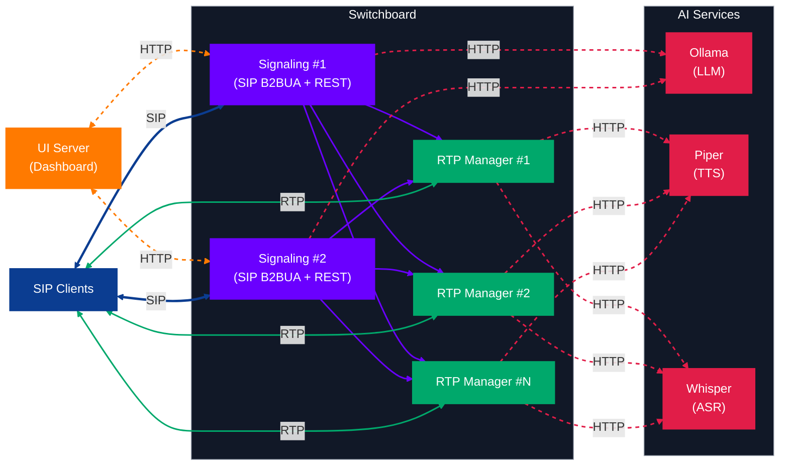
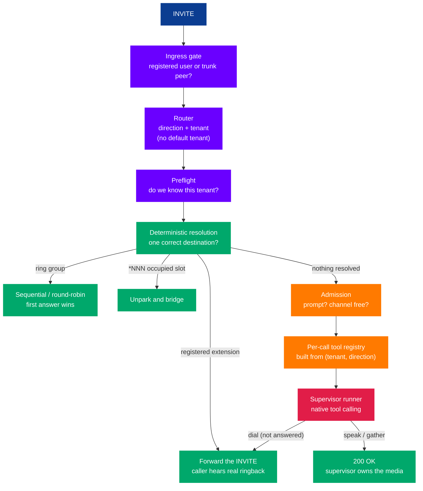
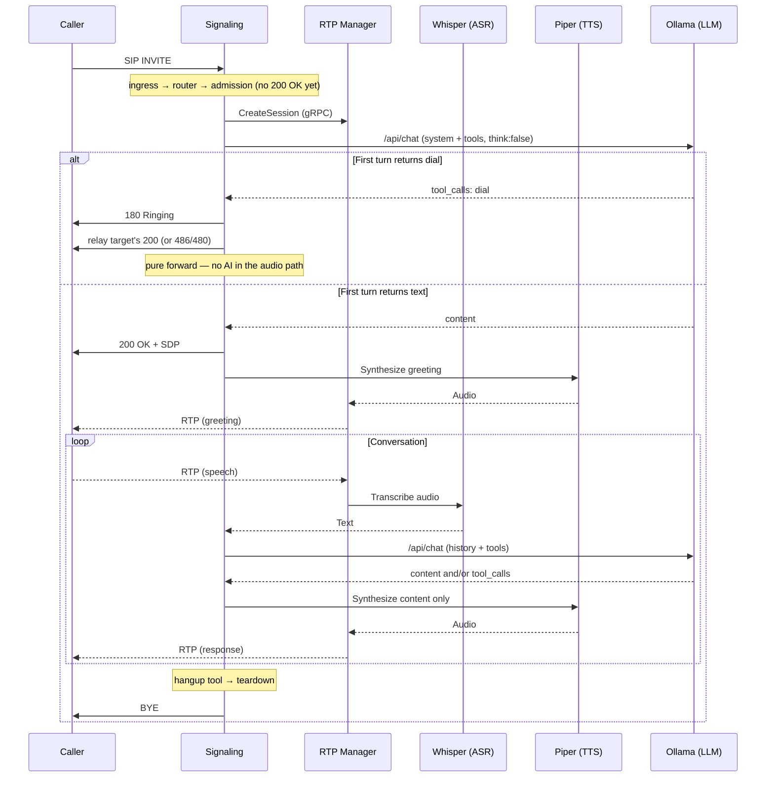

# Switchboard


> **WARNING: EXPERIMENTAL PROJECT**
> This is a **learning project** in active development. It is **pre-alpha**, **unstable**, and **not suitable for any production use**. The architecture is still being decided. Entire subsystems may be rewritten without notice. APIs will break. Config formats will change. Here be dragons.

## About

Switchboard is a **full-stack VoIP server and AI-driven call routing engine**. It handles the complete telephony lifecycle — SIP registrations, presence, inbound and outbound calls, call bridging, parking, and transfers — while using a small LLM to make intelligent routing decisions based on tenant-specific configuration. It separates signaling and media into independently scalable components, using SIP for call control, RTP for media transport, and gRPC to coordinate services. At its core, Switchboard replaces static IVR trees with a smart AI routing that understands context and makes decisions like a human receptionist would.

Switchboard is **Kubernetes-native by design**. Live media re-anchoring allows active calls to be migrated between RTP Manager pods mid-call, making graceful drain, rolling updates, and autoscaling possible without dropping calls.

The routing agent **stays with the caller for the entire duration of the call**. Switchboard's agent maintains full context throughout — if a transfer fails because nobody picked up, the agent comes back, apologizes, and offers alternatives (try another person, take a voicemail, schedule a callback). The caller is never left in a dead end. It's like having a real switchboard receptionist who stays with you until you're taken care of.


```mermaid
flowchart LR
  UI["UI Server<br/>(Dashboard)"]
  Clients["SIP Clients"]

  subgraph Core["Switchboard"]
    direction TB
    Sig1["Signaling #1<br/>(SIP B2BUA + REST)"]
    Sig2["Signaling #2<br/>(SIP B2BUA + REST)"]
    RTP1["RTP Manager #1"]
    RTP2["RTP Manager #2"]
    RTP3["RTP Manager #N"]
    Sig1 --> RTP1
    Sig1 --> RTP2
    Sig1 --> RTP3
    Sig2 --> RTP1
    Sig2 --> RTP2
    Sig2 --> RTP3
  end

  subgraph AI["AI Services"]
    direction TB
    LLM["Ollama<br/>(LLM)"]
    TTS["Piper<br/>(TTS)"]
    ASR["Whisper<br/>(ASR)"]
  end

  %% Edges
  UI <-->|"HTTP"| Sig1
  UI <-->|"HTTP"| Sig2
  Clients <-->|"SIP"| Sig1
  Clients <-->|"SIP"| Sig2
  Clients <-->|"RTP"| RTP1
  Clients <-->|"RTP"| RTP2
  Clients <-->|"RTP"| RTP3
  Sig1 -->|"HTTP"| LLM
  Sig2 -->|"HTTP"| LLM
  RTP1 -->|"HTTP"| TTS
  RTP1 -->|"HTTP"| ASR
  RTP2 -->|"HTTP"| TTS
  RTP2 -->|"HTTP"| ASR
  RTP3 -->|"HTTP"| TTS
  RTP3 -->|"HTTP"| ASR

  %% Styling
  classDef clients fill:#0b3d91,stroke:#0b3d91,color:#ffffff,stroke-width:2px;
  classDef signaling fill:#6a00ff,stroke:#6a00ff,color:#ffffff,stroke-width:2px;
  classDef media fill:#00a86b,stroke:#00a86b,color:#ffffff,stroke-width:2px;
  classDef ui fill:#ff7a00,stroke:#ff7a00,color:#ffffff,stroke-width:2px;
  classDef ai fill:#e11d48,stroke:#e11d48,color:#ffffff,stroke-width:2px;
  classDef plane fill:#111827,stroke:#9ca3af,color:#ffffff,stroke-width:1px;

  class Clients clients;
  class Sig1,Sig2 signaling;
  class RTP1,RTP2,RTP3 media;
  class UI ui;
  class TTS,ASR,LLM ai;
  class Core,AI plane;

  %% Internal: Sig1 → RTP1,2,3
  linkStyle 0 stroke:#6a00ff,stroke-width:2px;
  linkStyle 1 stroke:#6a00ff,stroke-width:2px;
  linkStyle 2 stroke:#6a00ff,stroke-width:2px;
  %% Internal: Sig2 → RTP1,2,3
  linkStyle 3 stroke:#6a00ff,stroke-width:2px;
  linkStyle 4 stroke:#6a00ff,stroke-width:2px;
  linkStyle 5 stroke:#6a00ff,stroke-width:2px;
  %% UI ↔ Sig1, Sig2
  linkStyle 6 stroke:#ff7a00,stroke-width:2px,stroke-dasharray: 5 5;
  linkStyle 7 stroke:#ff7a00,stroke-width:2px,stroke-dasharray: 5 5;
  %% Clients ↔ Sig1, Sig2 (SIP)
  linkStyle 8 stroke:#0b3d91,stroke-width:3px;
  linkStyle 9 stroke:#0b3d91,stroke-width:3px;
  %% Clients ↔ RTP1, RTP2, RTP3
  linkStyle 10 stroke:#00a86b,stroke-width:2px;
  linkStyle 11 stroke:#00a86b,stroke-width:2px;
  linkStyle 12 stroke:#00a86b,stroke-width:2px;
  %% Sig1, Sig2 → LLM
  linkStyle 13 stroke:#e11d48,stroke-width:2px,stroke-dasharray: 5 5;
  linkStyle 14 stroke:#e11d48,stroke-width:2px,stroke-dasharray: 5 5;
  %% RTP → TTS, ASR
  linkStyle 15 stroke:#e11d48,stroke-width:2px,stroke-dasharray: 5 5;
  linkStyle 16 stroke:#e11d48,stroke-width:2px,stroke-dasharray: 5 5;
  linkStyle 17 stroke:#e11d48,stroke-width:2px,stroke-dasharray: 5 5;
  linkStyle 18 stroke:#e11d48,stroke-width:2px,stroke-dasharray: 5 5;
  linkStyle 19 stroke:#e11d48,stroke-width:2px,stroke-dasharray: 5 5;
  linkStyle 20 stroke:#e11d48,stroke-width:2px,stroke-dasharray: 5 5;
```

## Quick Start

```bash
# Clone
git clone https://github.com/sebas/switchboard.git
cd switchboard

# Build
make build-all

# Run all services
make run

# Or run individually
./switchboard-rtpmanager --grpc-port 9090 &
./switchboard-signaling --rtpmanager localhost:9090 &
./switchboard-ui --backends http://localhost:8080
```

## How It Works

Every INVITE — internal, inbound, and outbound — is handed to a single **LLM
supervisor**. There is no dialplan and no fast-path matcher: the model decides
what happens to each call, inside a deterministic boundary that decides what it
is *allowed* to do.

The defining constraint is that **the model is untrusted**. Caller speech becomes
prompt text, and a `dial` can reach a trunk and cost money, so every security,
cost, and correctness decision lives in deterministic Go around a zero-authority
model — never in the prompt.

### The call path


```mermaid
flowchart TB
    Call["INVITE"] --> Ingress["Ingress gate<br/>registered user or trunk peer?"]
    Ingress --> Router["Router<br/>direction + tenant<br/>(no default tenant)"]
    Router --> Preflight["Preflight<br/>do we know this tenant?"]
    Preflight --> Resolve["Deterministic resolution<br/>one correct destination?"]
    Resolve -->|"registered extension"| Forward["Forward the INVITE<br/>caller hears real ringback"]
    Resolve -->|"ring group"| Group["Sequential / round-robin<br/>first answer wins"]
    Resolve -->|"*NNN occupied slot"| Pickup["Unpark and bridge"]
    Resolve -->|"nothing resolved"| Admission["Admission<br/>prompt? channel free?"]
    Admission --> Registry["Per-call tool registry<br/>built from (tenant, direction)"]
    Registry --> Supervisor["Supervisor runner<br/>native tool calling"]
    Supervisor -->|"dial (not answered)"| Forward
    Supervisor -->|"speak / gather"| Answer["200 OK<br/>supervisor owns the media"]

    style Call fill:#0b3d91,stroke:#0b3d91,color:#fff
    style Ingress fill:#6a00ff,stroke:#6a00ff,color:#fff
    style Router fill:#6a00ff,stroke:#6a00ff,color:#fff
    style Preflight fill:#6a00ff,stroke:#6a00ff,color:#fff
    style Resolve fill:#00a86b,stroke:#00a86b,color:#fff
    style Group fill:#00a86b,stroke:#00a86b,color:#fff
    style Pickup fill:#00a86b,stroke:#00a86b,color:#fff
    style Admission fill:#ff7a00,stroke:#ff7a00,color:#fff
    style Registry fill:#ff7a00,stroke:#ff7a00,color:#fff
    style Supervisor fill:#e11d48,stroke:#e11d48,color:#fff
    style Forward fill:#00a86b,stroke:#00a86b,color:#fff
    style Answer fill:#00a86b,stroke:#00a86b,color:#fff
```

Everything before the supervisor is deterministic and runs **before** any model
call and **before** the call is answered:

1. **Ingress gate** — an INVITE must come from a registered directory user or a
   configured trunk peer. Anything else is 403. (Requires the SIP trunk: see
   `resources/config/trunk_peers.json` and `routes.json`.)
2. **Router** — classifies direction and resolves the tenant. Internal and
   outbound take the tenant from the From-host's leftmost label; inbound takes it
   from the DID table. **There is no default tenant** — an unattributable call is
   404, not a guess.
3. **Preflight** — do we know this tenant at all? A tenant is known by its prompt,
   its routing table, or both.
4. **Resolution** — if the dialed target has exactly one correct destination, it
   is executed here and the model is never called. Four shapes qualify and no
   others: a registered directory extension, a `*NNN` pickup of an occupied
   parking slot from an internal caller, an inbound DID with a mapping, and a
   named ring group. Everything else — anything needing judgement about intent,
   wording, or business context — goes to the supervisor.
5. **Admission** — reached only when nothing resolved. The tenant must have a
   non-empty prompt and a free channel; at the limit the call gets 486 Busy. The
   channel limit bounds concurrent **supervised** calls, so a resolved extension
   dial never consumes one.

Resolution is not a dialplan and not a bypass. Its destinations go through the
same `Policy.AuthorizeDial` a model-issued dial does, with the same decision
logging — the routing table is data, never authority. And because a resolved call
makes no LLM request, an Ollama outage degrades to "the AI receptionist is
unavailable" while extension dialing, pickup, and queues keep working.

### The model is checked and warmed at startup

The signaling server verifies the LLM answers and that the configured model is
pulled, then loads it before any caller arrives, logging what that cost:

```
LLM ready and warmed load_time=6.774s
```

Neither check can fail startup. A missing model or a dead LLM is a warning,
because a call the tenant's routing table resolves needs no model at all — that
is the point of putting resolution first. Every chat request carries
`keep_alive` (default 30m) so the model stays resident between calls; Ollama's
own 5-minute default is shorter than the gap between calls on a quiet PBX, which
means the first call of the day would otherwise pay the load inside the caller's
turn budget.

### The supervisor answers only when it means to

The INVITE handler **never** sends a 200 OK. The first turn decides:

| First turn returns | What happens |
| --- | --- |
| `dial` (call not answered) | The INVITE is **forwarded**. 180 goes upstream, the target's own 200 — or its 486/480 — is relayed back. The caller hears the real phone ring. |
| Spoken text | 200 OK. The supervisor owns the media, speaks via TTS, and enters the listen/speak loop. |
| `dial` (already answered) | The outbound leg is bridged into the media the supervisor already owns. |

Answering means "the AI handles this leg's media itself". A staff member dialing
an extension is therefore a **pure forward** with no AI in the audio path — which
is why the tenant prompt tells the model to route an internal call silently, with
a tool call and no text.

### Authorization: the model asks, the policy decides

Two independent layers, neither of which the model can talk its way past:

**Affordance removal (per-call registry).** The tool set is built per call from
`(tenant, direction)`. An **inbound** caller's registry contains **no
external-dial tool at all** — there is nothing to authorize because there is
nothing to call. `unpark` is likewise internal-only, so an outside caller cannot
guess a slot number and pick up a colleague's held call.

**Class of Service (`resources/config/policy.json`).** Every consequential call
is adjudicated before it executes:

- **Capability narrowing** — the model emits *symbolic* targets (`sales`,
  `front-desk`) that a deterministic resolver maps to real destinations. It cannot
  express a raw `+1900…` through the normal `dial` tool at all.
- **Default-deny external** with a prefix allowlist, plus barred classes
  (premium-rate, satellite, IRSF-heavy country codes) that are denied
  unconditionally.
- **Spend circuit breaker** per tenant.
- **Decision logging** for every verdict — a denied external dial is a fraud
  signal.

A missing `policy.json` is the safest posture, not an error: no external dialing
anywhere.

### Tools

`dial`, `hangup`, `play_audio`, `park`, `unpark`. Speech is implicit — ordinary
text is spoken, listening is the runner's job. Each handler returns a
disposition the dispatch loop acts on: `Continue`, `Terminal`, or `Parked` (the
loop holds the call without driving further turns; the handler never blocks).

### Native tool calling

The supervisor uses Ollama's native **`/api/chat`** endpoint — not the
OpenAI-compatible `/v1/chat/completions` — with `think: false`. The native
endpoint returns `thinking`, `content`, and `tool_calls` as *separate fields*, so
reasoning can never leak into text-to-speech. (`/v1` folds reasoning into
`<think>` tags inside content, which is version-dependent and one bad parse away
from speaking the model's scratchpad to a caller.) Only `content` is ever spoken.

`think: false` is effectively forced by the latency budget: a thinking pass costs
seconds, and the first turn runs *inside the INVITE transaction*.

No third-party LLM library is used — the client is `net/http` against Ollama.

### The runner: one loop, three nested scopes

```
callCtx          ← BYE / CANCEL / timeout → idempotent teardown funnel
  └─ turnCtx     ← runaway breaker / per-turn deadline → abort one turn
       └─ playbackCtx ← barge-in → cancel TTS only, the turn survives
```

One dispatch loop drains one events channel; producers write with a select that
also observes cancellation, and **the channel is never closed**. Everything that
blocks inside a turn — the LLM call, each tool handler, `Listen` — honors its own
scope, because the loop's top-level select only sees cancellation *between* turns.

Two safety mechanisms fall out of this shape:

- **Idempotent teardown.** Caller BYE, the `hangup` tool, and a context timeout
  all converge on one `teardown(reason)` guarded by `sync.Once`. It releases the
  admission slot, cancels an orphaned outbound leg, and branches on whether we
  ever answered — pre-answer aborts send **487** and CANCEL the B-leg, post-answer
  aborts send BYE.
- **Runaway-turn breaker.** Turns are *reactive* (caller input, human-rate-limited)
  or *autonomous* (a tool result re-prompting the model, rate-limited by nothing).
  Consecutive autonomous turns are bounded: a soft cap stops re-prompting, a hard
  cap speaks a deterministic message and hangs up. Any caller input resets it.

### AI Services

The supervisor connects three external services:

- **LLM** (Ollama) — the supervisor, default model `qwen3:8b`
- **ASR** (Whisper) — Speech-to-text for caller input
- **TTS** (Piper) — Text-to-speech for agent responses


```mermaid
sequenceDiagram
    participant Caller
    participant Signaling
    participant RTP as RTP Manager
    participant ASR as Whisper (ASR)
    participant TTS as Piper (TTS)
    participant LLM as Ollama (LLM)

    Caller->>Signaling: SIP INVITE
    Note over Signaling: ingress → router → admission (no 200 OK yet)
    Signaling->>RTP: CreateSession (gRPC)
    Signaling->>LLM: /api/chat (system + tools, think:false)

    alt First turn returns dial
        LLM-->>Signaling: tool_calls: dial
        Signaling->>Caller: 180 Ringing
        Signaling->>Caller: relay target's 200 (or 486/480)
        Note over Signaling: pure forward — no AI in the audio path
    else First turn returns text
        LLM-->>Signaling: content
        Signaling->>Caller: 200 OK + SDP
        Signaling->>TTS: Synthesize greeting
        TTS-->>RTP: Audio
        RTP-->>Caller: RTP (greeting)

        loop Conversation
            Caller-->>RTP: RTP (speech)
            RTP->>ASR: Transcribe audio
            ASR-->>Signaling: Text
            Signaling->>LLM: /api/chat (history + tools)
            LLM-->>Signaling: content and/or tool_calls
            Signaling->>TTS: Synthesize content only
            TTS-->>RTP: Audio
            RTP-->>Caller: RTP (response)
        end

        Note over Signaling: hangup tool → teardown
        Signaling->>Caller: BYE
    end
```

### Tenant Configuration

The supervisor uses a two-layer prompt system, both layers live-reloadable
through the config API:

1. **Settings** (`resources/config/settings.md`) — Shared across all tenants. Defines the tool contract, the per-direction rules ("route, don't greet" for internal calls), and prompt hardening.
2. **Tenant config** (`resources/tenants/<name>.md`) — Loaded per call. Contains the complete business knowledge base: identity, departments, staff directory, routing rules, hours, escalation paths, scripted responses. Selected by the **resolved tenant**, not by a route parameter.

A tenant is described by three files: a Markdown prompt (judgement — identity, tone, business
facts, escalation), a `<tenant>.routing.json` table (data — extensions, DIDs, ring groups, and the
names the model may dial), and a block in `policy.json` (authorization — what is permitted).
Routing data is deliberately kept out of the prompt so a call to a known extension is connected
without waiting on a model.

See [`docs/TENANT-EXAMPLE.md`](docs/TENANT-EXAMPLE.md) for a fully worked example of all three.
`resources/tenants/` ships only `devtenant`, a minimal fixture for local testing — there is no
default tenant, and a call matching none is rejected.

A tenant with no file is **not admissible** — it cannot inherit `settings.md` and
quietly become a generic receptionist. That is the "no default tenant" rule.

Treat `tenant.md` as **semi-public**: a caller may be able to coax it out of the
model, so it must never contain secrets.

### Running with AI Services

Switchboard talks to LLM, ASR, and TTS over HTTP. It doesn't care how you bring those up — install them however you like and point Switchboard at their endpoints with `--llm-server`, `--asr-server`, and `--tts-server`.

The fastest path is the bundled compose file, which starts Ollama, Whisper, and Piper on the ports Switchboard defaults to:

```bash
make services-up        # starts Ollama (:11434), Whisper (:8001), Piper (:8000)
                        # and pulls the LLM model on first run

go run cmd/rtpmanager/main.go &
go run cmd/signaling/main.go &
go run cmd/ui/main.go

# Call extension 600 from a SIP client to reach the AI agent
```

Override the models via env vars (e.g. `OLLAMA_MODEL=llama3.2:3b WHISPER_MODEL=Systran/faster-whisper-base make services-up`). `make services-down` stops them; `make services-logs` tails output. Models persist in named volumes across restarts.

If you'd rather run the services manually (e.g. on a different host, with GPUs, or a different image):

```bash
# 1. Ollama (LLM) — install from https://ollama.com
ollama serve &
ollama pull qwen3:8b

# 2. Whisper (ASR) — https://github.com/fedirz/faster-whisper-server
docker run -d --name whisper-asr -p 8001:8000 \
  -e WHISPER__MODEL=Systran/faster-whisper-tiny \
  fedirz/faster-whisper-server:latest-cpu

# 3. Piper TTS — https://github.com/matatonic/openedai-speech
docker run -d --name piper-tts -p 8000:8000 \
  ghcr.io/matatonic/openedai-speech

# 4. Point Switchboard at non-default hosts/ports if needed
go run cmd/rtpmanager/main.go \
  --asr-server http://localhost:8001 \
  --tts-server http://localhost:8000 &

go run cmd/signaling/main.go \
  --llm-server http://localhost:11434 \
  --llm-model qwen3:8b &

go run cmd/ui/main.go

# 5. Register a softphone and dial another registered extension
```

The AI services can run on any reachable host — replace `localhost` with the IP of wherever you started them.

The signaling server **requires** an LLM server: without a supervisor there is
nothing to route calls, so it refuses to start rather than running unsupervised.

### Trying the supervisor without SIP

`cmd/agent-smoke` drives the real runner against real Ollama with a fake call
session, so you can watch routing decisions without softphones, RTP, ASR, or TTS.
Stdin becomes caller speech; tool dispatches and TTS print with a `>>>` prefix.

```bash
# Internal call: expect an immediate ">>> forward user/105" and no spoken text
go run ./cmd/agent-smoke --direction internal --caller 102 --callee 105

# Inbound call: expect a greeting, then intent routing as you type
go run ./cmd/agent-smoke --direction inbound --caller +15551234567 --callee 5558001200
```

Use `--verbose` to surface the model's `thinking` field on stderr — it must never
appear in a `>>> tts:` line.

### Configuration Files

| File | Purpose |
| --- | --- |
| `resources/config/settings.md` | Shared supervisor instructions: tool contract, per-direction rules, prompt hardening |
| `resources/tenants/<name>.md` | Per-tenant **judgement**: identity, tone, business facts, escalation language. No routing data |
| `resources/tenants/<name>.routing.json` | Per-tenant **routing data**: extensions, DIDs, ring groups, and the symbolic names the model may dial. Read by both the resolver and capability narrowing, so a name cannot mean two things |
| `resources/config/policy.json` | Class of Service and capacity only: channel limits, external allowlist, barred prefixes, spend breaker. A leftover `symbolic_targets` key here is a hard startup error — it moved to the routing file |
| `resources/config/trunk_peers.json` | SIP trunk peers — the ingress gate matches inbound INVITEs against these |
| `resources/config/routes.json` | DID → tenant mapping for inbound calls |

## Vision & Roadmap

Switchboard aims to replace static IVR trees and rigid call routing with an AI engine that reads natural language configuration and makes decisions like a human receptionist would.

### What Works Today

- SIP REGISTER with in-memory location service
- SIP trunk peers with DID → tenant routing, and an ingress gate that rejects unknown sources
- B2BUA call bridging (A-leg to B-leg)
- RTP media bridging between sessions
- Basic admin dashboard with live updates
- Multiple RTP Manager load balancing with session affinity
- **Live media re-anchoring** — sessions can be migrated between RTP Managers mid-call (both IVR and bridged calls), enabling graceful drain and zero-downtime updates
- RTP Manager drain API (graceful and aggressive modes) with per-session migration
- **LLM supervisor on every call** — no dialplan, no fast-path matcher
  - Deferred answer: `dial` forwards the INVITE (real ringback), speech answers and takes the media
  - Native Ollama `/api/chat` tool calling with `think: false`, so reasoning never reaches TTS
  - Per-call tool registry scoped by `(tenant, direction)` — inbound gets no external dial
  - Deterministic tool authorization: Class of Service, symbolic-target narrowing, barred prefixes, spend breaker
  - Per-tenant admission with channel limits (486 at the limit) and no default tenant
  - Idempotent teardown funnel, nested call/turn/playback scopes, runaway-turn breaker
- Speech recognition via Whisper ASR server (batch transcription)
- Text-to-speech playback through TTS server
- Per-tenant LLM personalities loaded from markdown files

### What Doesn't Work Yet

- Authentication (anyone can register as anyone)
- Persistent storage (everything is in-memory)
- SRTP/TLS (plaintext only)
- Most SIP edge cases (re-INVITE, UPDATE, REFER, etc.)
- Proper error handling in many places
- Barge-in — the caller cannot interrupt the AI mid-sentence; the `playbackCtx` scope exists for it, but it needs speech-onset detection from the media layer
- Mid-call tools (transfer, recording control, conference, mute)

### What Might Be Wrong

- The entire B2BUA implementation
- SDP manipulation
- RTP timing and jitter handling
- Basically anything that has not been tested with real traffic

### Where We're Headed

**Context enrichment before the supervisor.** The deterministic pre-LLM layer (ingress → router → admission) is the right place to make HTTP requests, query databases, and inspect SIP headers, so the supervisor starts its first turn already knowing who the caller is. That layer is deterministic and fast; the supervisor is flexible and intelligent. Each does what it's best at.

**Barge-in.** The runner already isolates TTS playback in its own `playbackCtx`, so cancelling a prompt mid-utterance without disturbing the turn or the call is a solved problem structurally. What is missing is the trigger: the media layer needs to expose speech-onset/VAD so a contentless interrupt event can fire the cancel.

**Small, focused models.** We deliberately use small LLMs (8B parameters) for routing decisions. The AI engine is not meant to be a general-purpose chatbot — it's a decision-making engine that operates within the boundaries of a tenant's configuration. Small models are faster, cheaper, and more predictable. We accept that they may occasionally make odd decisions, but the bounded context (tenant config + settings) keeps them on track.

**Known trade-offs.** AI routing will sometimes do unexpected things. We mitigate this by keeping the model small, the configuration explicit, and the action set limited. The tenant markdown file is the guardrail — if the AI doesn't know something, it should say so and take a safe default action (take a message, transfer to a general queue). Over time, we'll add monitoring and feedback loops to catch and correct bad decisions.

**Recording and real-time transcription.** Call recording with automatic transcription is planned. Real-time transcription will allow live captions and enable features like supervisor monitoring and compliance tooling.

**Barging and supervisor tools.** Call barging (listen, whisper, barge-in) will give supervisors the ability to monitor and intervene in live calls. Combined with real-time transcription, this enables a full contact center toolkit.

**WebRTC gateway.** A WebRTC gateway will allow browser-based communication — agents, supervisors, and end users connecting directly from a web browser without a SIP client. This opens up softphone UIs, click-to-call, and embedded voice widgets.

**Smart autoscaling and zero-downtime updates.** Live media re-anchoring already works today — the missing piece is an intelligent orchestration layer that signals RTP Manager pods to drain, waits for sessions to migrate, and scales the pool up or down based on load. The goal is daytime updates with no call drops: the system tells a pod to drain, sessions re-anchor to healthy pods, and the empty pod gets replaced. This is a natural extension of the drain API that already exists.

**MCP (Model Context Protocol) support.** MCP integration will allow the AI engine to use external tools during a call — looking up customer records, checking order status, querying CRMs — giving the LLM access to live data rather than relying solely on the static tenant configuration file.

## Documentation

| Document | Description |
|----------|-------------|
| [Configuration](docs/CONFIGURATION.md) | All flags and environment variables per service |

## Technology Stack

- **Go 1.24** - Single binaries, goroutines, and a great standard library
- **[sipgo](https://github.com/emiago/sipgo)** - Pure Go SIP stack
- **[diago](https://github.com/emiago/diago)** - B2BUA patterns and inspiration
- **[Pion](https://github.com/pion)** - RTP, SDP, and WebRTC ecosystem
- **gRPC** - Service communication between signaling and media
- **HTMX + Tailwind** - Dashboard UI

## Acknowledgments

### [Pion](https://github.com/pion)
The Pion project provides the entire foundation for RTP, SDP, and WebRTC in Go. Without Pion's clean, well-tested libraries for packet handling, SDP parsing, and media transport, building something like this would take years instead of weeks.

### [sipgo](https://github.com/emiago/sipgo) & [diago](https://github.com/emiago/diago)
Emiago's sipgo library is a pure-Go SIP stack that actually makes sense. The diago project, built on top of sipgo, provided invaluable patterns for B2BUA implementation, dialog management, and call handling.

**Thank you to all these projects. Switchboard is an experiment built on your foundations.**

## Contributing

Contributions are welcome, but please understand what you are getting into:

1. **This is unstable** - Things will break. APIs will change. Your PR might become irrelevant overnight.
2. **No promises** - This is a side project for learning. Response times will vary.
3. **Discussion first** - For anything non-trivial, open an issue to discuss before submitting a PR.

If you are also curious about VoIP systems and want to experiment together, pull up a chair. If this project somehow helps you learn something, that is the whole point.
