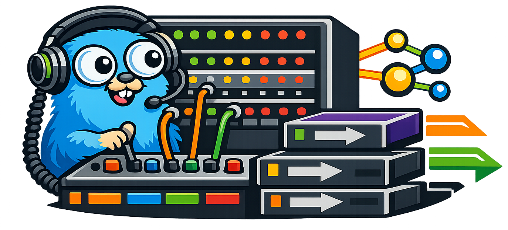
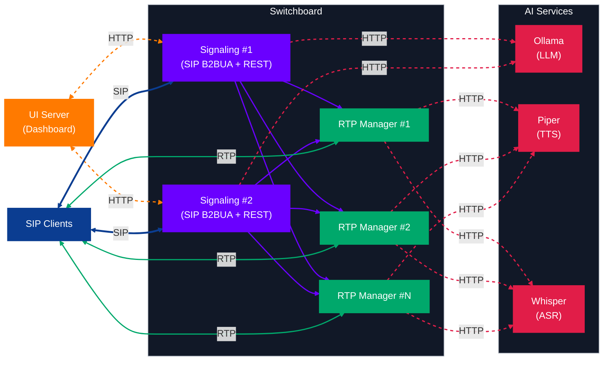
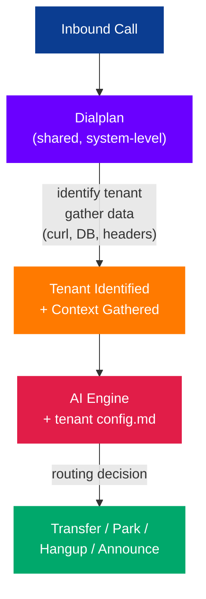
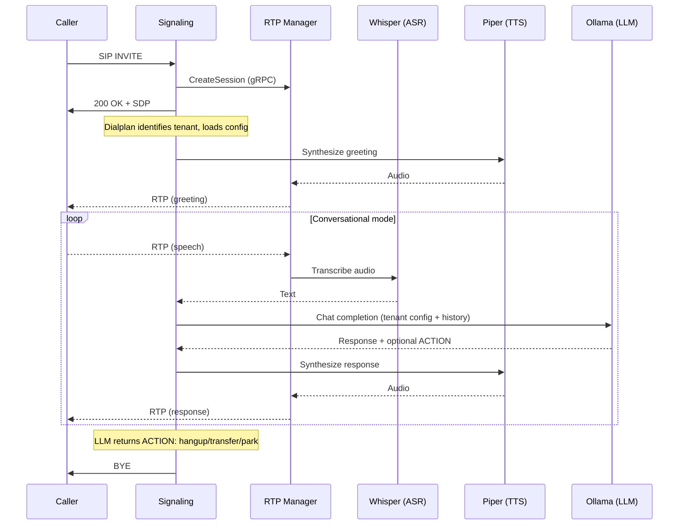

# Switchboard



> **WARNING: EXPERIMENTAL PROJECT**
> This is a **learning project** in active development. It is **pre-alpha**, **unstable**, and **not suitable for any production use**. The architecture is still being decided. Entire subsystems may be rewritten without notice. APIs will break. Config formats will change. Here be dragons.

## About

Switchboard is a **full-stack VoIP server and AI-driven call routing engine**. It handles the complete telephony lifecycle — SIP registrations, presence, inbound and outbound calls, call bridging, parking, and transfers — while using a small LLM to make intelligent routing decisions based on tenant-specific configuration. It separates signaling and media into independently scalable components, using SIP for call control, RTP for media transport, and gRPC to coordinate services. At its core, Switchboard replaces static IVR trees with a smart AI routing that understands context and makes decisions like a human receptionist would.

Switchboard is **Kubernetes-native by design**. Live media re-anchoring allows active calls to be migrated between RTP Manager pods mid-call, making graceful drain, rolling updates, and autoscaling possible without dropping calls.


```mermaid
flowchart LR
  UI["UI Server<br/>(Dashboard)"]
  Clients["SIP Clients"]

  subgraph Core["Switchboard"]
    direction TB
    Sig1["Signaling #1<br/>(SIP B2BUA + REST)"]
    Sig2["Signaling #2<br/>(SIP B2BUA + REST)"]
    RTP1["RTP Manager #1"]
    RTP2["RTP Manager #2"]
    RTP3["RTP Manager #N"]
    Sig1 --> RTP1
    Sig1 --> RTP2
    Sig1 --> RTP3
    Sig2 --> RTP1
    Sig2 --> RTP2
    Sig2 --> RTP3
  end

  subgraph AI["AI Services"]
    direction TB
    LLM["Ollama<br/>(LLM)"]
    TTS["Piper<br/>(TTS)"]
    ASR["Whisper<br/>(ASR)"]
  end

  %% Edges
  UI <-->|"HTTP"| Sig1
  UI <-->|"HTTP"| Sig2
  Clients <-->|"SIP"| Sig1
  Clients <-->|"SIP"| Sig2
  Clients <-->|"RTP"| RTP1
  Clients <-->|"RTP"| RTP2
  Clients <-->|"RTP"| RTP3
  Sig1 -->|"HTTP"| LLM
  Sig2 -->|"HTTP"| LLM
  RTP1 -->|"HTTP"| TTS
  RTP1 -->|"HTTP"| ASR
  RTP2 -->|"HTTP"| TTS
  RTP2 -->|"HTTP"| ASR
  RTP3 -->|"HTTP"| TTS
  RTP3 -->|"HTTP"| ASR

  %% Styling
  classDef clients fill:#0b3d91,stroke:#0b3d91,color:#ffffff,stroke-width:2px;
  classDef signaling fill:#6a00ff,stroke:#6a00ff,color:#ffffff,stroke-width:2px;
  classDef media fill:#00a86b,stroke:#00a86b,color:#ffffff,stroke-width:2px;
  classDef ui fill:#ff7a00,stroke:#ff7a00,color:#ffffff,stroke-width:2px;
  classDef ai fill:#e11d48,stroke:#e11d48,color:#ffffff,stroke-width:2px;
  classDef plane fill:#111827,stroke:#9ca3af,color:#ffffff,stroke-width:1px;

  class Clients clients;
  class Sig1,Sig2 signaling;
  class RTP1,RTP2,RTP3 media;
  class UI ui;
  class TTS,ASR,LLM ai;
  class Core,AI plane;

  %% Internal: Sig1 → RTP1,2,3
  linkStyle 0 stroke:#6a00ff,stroke-width:2px;
  linkStyle 1 stroke:#6a00ff,stroke-width:2px;
  linkStyle 2 stroke:#6a00ff,stroke-width:2px;
  %% Internal: Sig2 → RTP1,2,3
  linkStyle 3 stroke:#6a00ff,stroke-width:2px;
  linkStyle 4 stroke:#6a00ff,stroke-width:2px;
  linkStyle 5 stroke:#6a00ff,stroke-width:2px;
  %% UI ↔ Sig1, Sig2
  linkStyle 6 stroke:#ff7a00,stroke-width:2px,stroke-dasharray: 5 5;
  linkStyle 7 stroke:#ff7a00,stroke-width:2px,stroke-dasharray: 5 5;
  %% Clients ↔ Sig1, Sig2 (SIP)
  linkStyle 8 stroke:#0b3d91,stroke-width:3px;
  linkStyle 9 stroke:#0b3d91,stroke-width:3px;
  %% Clients ↔ RTP1, RTP2, RTP3
  linkStyle 10 stroke:#00a86b,stroke-width:2px;
  linkStyle 11 stroke:#00a86b,stroke-width:2px;
  linkStyle 12 stroke:#00a86b,stroke-width:2px;
  %% Sig1, Sig2 → LLM
  linkStyle 13 stroke:#e11d48,stroke-width:2px,stroke-dasharray: 5 5;
  linkStyle 14 stroke:#e11d48,stroke-width:2px,stroke-dasharray: 5 5;
  %% RTP → TTS, ASR
  linkStyle 15 stroke:#e11d48,stroke-width:2px,stroke-dasharray: 5 5;
  linkStyle 16 stroke:#e11d48,stroke-width:2px,stroke-dasharray: 5 5;
  linkStyle 17 stroke:#e11d48,stroke-width:2px,stroke-dasharray: 5 5;
  linkStyle 18 stroke:#e11d48,stroke-width:2px,stroke-dasharray: 5 5;
  linkStyle 19 stroke:#e11d48,stroke-width:2px,stroke-dasharray: 5 5;
  linkStyle 20 stroke:#e11d48,stroke-width:2px,stroke-dasharray: 5 5;
```

## Quick Start

```bash
# Clone
git clone https://github.com/sebas/switchboard.git
cd switchboard

# Build
make build-all

# Run all services
make run

# Or run individually
./switchboard-rtpmanager --grpc-port 9090 &
./switchboard-signaling --rtpmanager localhost:9090 &
./switchboard-ui --backends http://localhost:8080
```

## How It Works

Switchboard is built around two core ideas: a **dialplan** for system-level routing and data gathering, and an **AI engine** that makes per-tenant decisions using natural language configuration.

### The Two Layers

**1. Dialplan — System-level orchestration**

The dialplan is a single execution pipeline that runs for every inbound call. It handles multi-tenant concerns: identifying the caller, determining which tenant they belong to, and gathering any data needed before the AI engine takes over. The dialplan is powerful enough to make routing decisions on its own (pattern matching, time-based rules, header inspection), but its primary role in an AI-driven setup is **preparation** — it identifies the tenant, pulls context from external systems (via HTTP requests, database lookups, etc.), and then hands off to the AI engine with the right configuration.

**2. AI Engine — Tenant-level decision making**

Once the dialplan has identified the tenant and gathered the necessary context, it engages the AI engine with a **tenant-specific markdown file** (`resources/tenants/<name>.md`). This file is the tenant's complete configuration: business identity, routing rules, staff directory, hours of operation, escalation paths, call queues — everything the AI needs to make intelligent decisions for that specific business. The AI engine reads this configuration and makes routing decisions accordingly.

This is how Switchboard does **multi-tenancy**: the dialplan is shared infrastructure that identifies and prepares; the tenant markdown file is the per-tenant brain that drives decisions.


```mermaid
flowchart TB
    Call["Inbound Call"] --> Dialplan["Dialplan<br/>(shared, system-level)"]
    Dialplan -->|"identify tenant<br/>gather data<br/>(curl, DB, headers)"| Prep["Tenant Identified<br/>+ Context Gathered"]
    Prep --> AI["AI Engine<br/>+ tenant config.md"]
    AI -->|"routing decision"| Action["Transfer / Park /<br/>Hangup / Announce"]

    style Call fill:#0b3d91,stroke:#0b3d91,color:#fff
    style Dialplan fill:#6a00ff,stroke:#6a00ff,color:#fff
    style Prep fill:#ff7a00,stroke:#ff7a00,color:#fff
    style AI fill:#e11d48,stroke:#e11d48,color:#fff
    style Action fill:#00a86b,stroke:#00a86b,color:#fff
```

### Operating Modes

The AI engine operates in two modes, configured per-route in the dialplan:

- **Conversational** (default) — Multi-turn dialogue. The agent greets the caller, listens for speech, sends it to the LLM, speaks the response, and repeats. The LLM can trigger actions (transfer, park, hangup) at any point. Use this for full receptionist replacement, intake, and complex routing.
- **Routing** — Single-shot decision. The agent plays a greeting, asks the LLM for a routing decision based on tenant instructions (no caller input), speaks the response, executes the action, and ends the call. Use this for after-hours messages, announcements, or simple call routing.

Both modes use the same tenant markdown file and the same small LLM. The difference is whether the caller participates in the conversation or the AI decides on its own.

### AI Services

The AI engine connects three external services:

- **LLM** (Ollama) — Makes routing and conversational decisions
- **ASR** (Whisper) — Speech-to-text for caller input
- **TTS** (Piper) — Text-to-speech for agent responses


```mermaid
sequenceDiagram
    participant Caller
    participant Signaling
    participant RTP as RTP Manager
    participant ASR as Whisper (ASR)
    participant TTS as Piper (TTS)
    participant LLM as Ollama (LLM)

    Caller->>Signaling: SIP INVITE
    Signaling->>RTP: CreateSession (gRPC)
    Signaling->>Caller: 200 OK + SDP

    Note over Signaling: Dialplan identifies tenant, loads config

    Signaling->>TTS: Synthesize greeting
    TTS-->>RTP: Audio
    RTP-->>Caller: RTP (greeting)

    loop Conversational mode
        Caller-->>RTP: RTP (speech)
        RTP->>ASR: Transcribe audio
        ASR-->>Signaling: Text
        Signaling->>LLM: Chat completion (tenant config + history)
        LLM-->>Signaling: Response + optional ACTION
        Signaling->>TTS: Synthesize response
        TTS-->>RTP: Audio
        RTP-->>Caller: RTP (response)
    end

    Note over Signaling: LLM returns ACTION: hangup/transfer/park
    Signaling->>Caller: BYE
```

### Tenant Configuration

The AI engine uses a two-layer prompt system:

1. **Settings** (`resources/config/settings.md`) — Loaded once at startup. Defines the action contract (available actions, response format, rules). Shared across all tenants.
2. **Tenant config** (`resources/tenants/<name>.md`) — Loaded per-call. Contains the complete business knowledge base: identity, departments, staff directory, routing rules, hours, escalation paths, scripted responses. Selected via the `config` param in the dialplan route.

A tenant config file is a self-contained document — it tells the AI everything it needs to know to act as a virtual receptionist for that specific business. See [`resources/tenants/default.md`](resources/tenants/default.md) for a full example.

### Quick Start

```bash
# 1. Start the AI services (Docker)
make services-start    # TTS + Whisper

# 2. Start Ollama (install from ollama.com if not installed)
ollama serve &
ollama pull llama3.1:8b

# 3. Run Switchboard with LLM enabled
./build/switchboard-rtpmanager --grpc-port 9090 &
./build/switchboard-signaling --rtpmanager localhost:9090 --llm-server http://localhost:11434 &

# 4. Call extension 600 from a SIP client to reach the AI agent
```

### Dialplan Example

```json
{
  "id": "5a1c18fd-f20c-4ddd-ae76-3430fb1fca55",
  "customer_id": "720fd275-a196-444c-949a-b90b2531c4a7",
  "pattern": "5558889999",
  "actions": [
    {
      "type": "ai_agent",
      "params": {
        "config": "default",
        "voice": "alloy",
        "model": "llama3.1:8b",
        "mode": "routing"
      }
    }
  ]
}
```

See the [Dialplan Reference](docs/DIALPLAN.md) for all `ai_agent` parameters.

## Vision & Roadmap

Switchboard aims to replace static IVR trees and rigid call routing with an AI engine that reads natural language configuration and makes decisions like a human receptionist would.

### What Works Today

- SIP REGISTER with in-memory location service
- Inbound INVITE -> 183 Session Progress -> 200 OK flow
- B2BUA call bridging (A-leg to B-leg)
- RTP media bridging between sessions
- Dialplan with pattern matching and Dial action
- Basic admin dashboard with live updates
- Multiple RTP Manager load balancing with session affinity
- **Live media re-anchoring** — sessions can be migrated between RTP Managers mid-call (both IVR and bridged calls), enabling graceful drain and zero-downtime updates
- RTP Manager drain API (graceful and aggressive modes) with per-session migration
- AI voice agent as a dialplan action (`ai_agent`) with two modes:
  - **Conversational**: multi-turn listen/LLM/speak loop with ASR and TTS
  - **Routing**: single-shot LLM decision (transfer, park, or hangup)
- LLM integration via Ollama (OpenAI-compatible API) with multi-turn conversation history
- Speech recognition via Whisper ASR server (batch transcription)
- Text-to-speech playback through TTS server
- Per-tenant LLM personalities loaded from markdown files

### What Doesn't Work Yet

- Authentication (anyone can register as anyone)
- Persistent storage (everything is in-memory)
- SRTP/TLS (plaintext only)
- Most SIP edge cases (re-INVITE, UPDATE, REFER, etc.)
- Proper error handling in many places
- Tests (there are almost none)

### What Might Be Wrong

- The entire B2BUA implementation
- SDP manipulation
- RTP timing and jitter handling
- Basically anything that has not been tested with real traffic

### Where We're Headed

**Dialplan as a data-gathering powerhouse.** The dialplan should be able to make HTTP requests, query databases, inspect SIP headers, and pull data from external systems — all before the AI engine is engaged. This makes it the right place to handle tenant identification, caller lookup, and context enrichment. The dialplan is deterministic and fast; the AI engine is flexible and intelligent. Each does what it's best at.

**Tenant config caching.** Today, tenant markdown files are loaded from disk on every call. As configurations grow and external data sources are added, we'll want to cache processed tenant configs to avoid redundant work. This is a natural optimization once the system proves itself.

**Small, focused models.** We deliberately use small LLMs (8B parameters) for routing decisions. The AI engine is not meant to be a general-purpose chatbot — it's a decision-making engine that operates within the boundaries of a tenant's configuration. Small models are faster, cheaper, and more predictable. We accept that they may occasionally make odd decisions, but the bounded context (tenant config + settings) keeps them on track.

**Known trade-offs.** AI routing will sometimes do unexpected things. We mitigate this by keeping the model small, the configuration explicit, and the action set limited. The tenant markdown file is the guardrail — if the AI doesn't know something, it should say so and take a safe default action (take a message, transfer to a general queue). Over time, we'll add monitoring and feedback loops to catch and correct bad decisions.

**Recording and real-time transcription.** Call recording with automatic transcription is planned. Real-time transcription will allow live captions and enable features like supervisor monitoring and compliance tooling.

**Barging and supervisor tools.** Call barging (listen, whisper, barge-in) will give supervisors the ability to monitor and intervene in live calls. Combined with real-time transcription, this enables a full contact center toolkit.

**WebRTC gateway.** A WebRTC gateway will allow browser-based communication — agents, supervisors, and end users connecting directly from a web browser without a SIP client. This opens up softphone UIs, click-to-call, and embedded voice widgets.

**Smart autoscaling and zero-downtime updates.** Live media re-anchoring already works today — the missing piece is an intelligent orchestration layer that signals RTP Manager pods to drain, waits for sessions to migrate, and scales the pool up or down based on load. The goal is daytime updates with no call drops: the system tells a pod to drain, sessions re-anchor to healthy pods, and the empty pod gets replaced. This is a natural extension of the drain API that already exists.

**MCP (Model Context Protocol) support.** MCP integration will allow the AI engine to use external tools during a call — looking up customer records, checking order status, querying CRMs — giving the LLM access to live data rather than relying solely on the static tenant configuration file.

### Kubernetes Deployment

```bash
# Deploy AI services to k3s
make k8s-deploy-ai     # Deploys TTS, ASR, and Ollama

# Or individually
make k8s-deploy-tts
make k8s-deploy-asr
make k8s-deploy-ollama
```

## Documentation

| Document | Description |
|----------|-------------|
| [Dialplan Reference](docs/DIALPLAN.md) | Route patterns, actions, AI agent parameters, variable substitution |
| [Configuration](docs/CONFIGURATION.md) | All flags and environment variables per service |
| [Deployment](docs/DEPLOYMENT.md) | Docker, Kubernetes, scaling, troubleshooting |

## Technology Stack

- **Go 1.24** - Single binaries, goroutines, and a great standard library
- **[sipgo](https://github.com/emiago/sipgo)** - Pure Go SIP stack
- **[diago](https://github.com/emiago/diago)** - B2BUA patterns and inspiration
- **[Pion](https://github.com/pion)** - RTP, SDP, and WebRTC ecosystem
- **gRPC** - Service communication between signaling and media
- **HTMX + Tailwind** - Dashboard UI

## Acknowledgments

### [Pion](https://github.com/pion)
The Pion project provides the entire foundation for RTP, SDP, and WebRTC in Go. Without Pion's clean, well-tested libraries for packet handling, SDP parsing, and media transport, building something like this would take years instead of weeks.

### [sipgo](https://github.com/emiago/sipgo) & [diago](https://github.com/emiago/diago)
Emiago's sipgo library is a pure-Go SIP stack that actually makes sense. The diago project, built on top of sipgo, provided invaluable patterns for B2BUA implementation, dialog management, and call handling.

**Thank you to all these projects. Switchboard is an experiment built on your foundations.**

## Contributing

Contributions are welcome, but please understand what you are getting into:

1. **This is unstable** - Things will break. APIs will change. Your PR might become irrelevant overnight.
2. **No promises** - This is a side project for learning. Response times will vary.
3. **Discussion first** - For anything non-trivial, open an issue to discuss before submitting a PR.

If you are also curious about VoIP systems and want to experiment together, pull up a chair. If this project somehow helps you learn something, that is the whole point.
